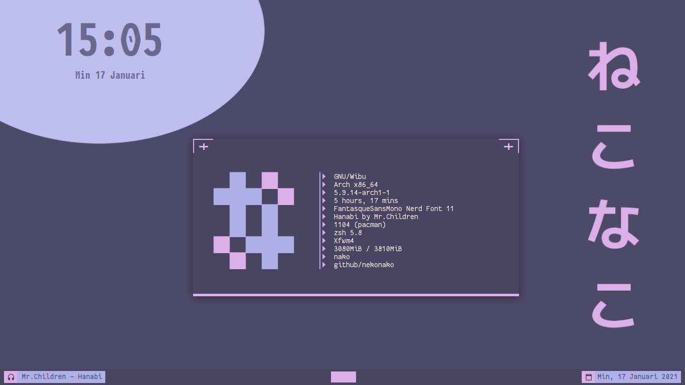
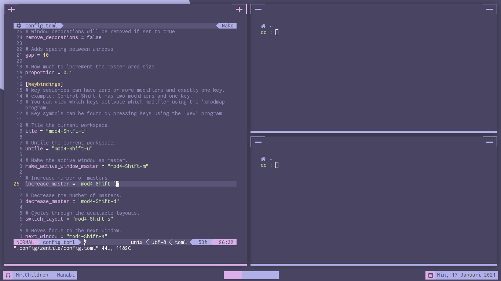

## Latar belakang
Linux merupakan sistem operasi yang sangat fleksibel, salah satu hal yang membuatnya fleksibel adalah kita bisa memilih desktop environment
kita sukai dan mengatur workflownya sesuai dengan kebiasaan kita.

Saya sendiri sudah satu tahun terakhir menggunkan i3 sebagai windows manager, dan i3 sangat nyaman digunkan.

Tapi ada kalanya kita bosan dan ingin mencoba hal baru, dan tiba-tiba saya teringat dengan setup dari salah satu 
legend di dunia persilatan yaitu mas [adhi](https://gihut.com/addy-dclxvi) yang menggunkan xfwm standalone.

Saya pun langsung mengintip config beliau dan mencobanya.

## Persiapan
Kita persiapkan terebih dahulu bahan-bahanya

```bash
sudo pacman -S xfwm4 nitrogen tint2 dunst conky redshift sxhkd xsettingsd polkit-gnome
```

Tentu package yang saya install diatas bersifat opsional, yang terpenting adalah menginstall **xfwm4**.

## Konfigurasi
Xfwm sendiri merupakan window manager yang digunakan pada xfce dan xfce sendiri merupakan desktop environment yang bersifat modular.

Oleh karena itu kita bisa menginstall komponenya tanpa harus menginstall desktop environmentnya itu sendiri.

Karena kita hanya menginstall window managernya saja, ada beberapa hal yang harus dilakukan secara manual.
berikut adalah flow dari login sampai menjalankan xfwm

<br/>

**FLOW**
> Display Manager => mejalankan session => menlajankan apliaksi ( autostart ) => menjalankan xfwm

Dari flow diatas kita dapat mengetahui apa saja yang harus kiya lakukan.


## Membuat session
Display manager seperti lightdm, slim, gdm dan lain-lain biasanya membaca session di directory `/usr/share/xsessions`, oleh karena itu akan membuat session untuk xfwm dan disimpan disana. 

Caranya mudah cuku buat file dengan extensi `.desktop`, lalu taruh di durectory `/usr/share/xsessions`.

<br/>

**# xfwm.desktop**

```bash
[Desktop Entry]
Name=Xfwm
Comment=Log in using the Xfwm window manager without session manager.
Exec=/usr/bin/xfwm4-session.sh
Icon=xfwm4
Type=Application
```

perhatikan bagian `Exec=/usr/bin/xfwm4-session.sh`, sebenarnya kita bisa saja langsung mengeksekusi xfwn, tapi sebelum itu
kita ingin menjalankan aplikasi-apliaksi yang kita butuhkan terlebih dahulu sebelum sebelum menjalankan xfwm.

Oleh karena itu kita membuat bash script simple yang digunakan untuk mengeksekusi aplikasi autostart dan xfwm.

<br/>

**# xfwm4-session.sh**

```bash
#!/bin/bash

/home/$USER/.config/xfwm4/autostart
xfwm4
```

> jangan lupa beri hak akses executeable

## Membuat autostart

```bash
mkdir ~/.config/xfwm4 && touch ~/.config/xfwm4/autostart
chmod +x ~/.config/xfwm4/autostart
```

<br/>

**# autostart**

```bash
nitrogen --restore &
sxhkd &
/usr/lib/polkit-gnome/polkit-gnome-authentication-agent-1 &
mpd &
redshift &
tint2 &
conky --config ~/.config/conky/simple/config.conkyrc &
xsettingsd &
```

## Membuat shortcut untuk aplikasi
**# ~/.config/sxhkd/sxhkdrc**

```bash
## Restart sxhkd
super + Escape
	pkill -USR1 -x sxhkd
## simple terminal
super + Return
    st
## alacritty
super + shift + Return 
    alacritty
## pcmanfm
super + f
    pcmanfm
## rofi
super + o
    rofi -show drun
## neovim
super + shift + n
    st -e 'nvim'
super + n
    alacritty -e 'nvim'
## music
super + m
    alacritty -e 'ncmpcpp'
## tmux
super + t
    alacritty -e 'tmux'
## firefox
super + w
    firefox
# dmenu
super + j
    j4-dmenu-desktop --dmenu="dmenu -h 30"
super + d 
    dmenu_run -h 30

### MEDIA BUTTON ###
# + volume
XF86AudioRaiseVolume 
    amixer -D pulse sset Master 5%+
# - volume
XF86AudioLowerVolume 
    amixer -D pulse sset Master 5%-
# mute
XF86AudioMute
    amixer -D pulse -q sset Master toggle
XF86AudioMic
    amixer -D pulse -q sset Mic toggle
# - brightness
XF86MonBrightnessDown
    light -U 5
# + brightness
XF86MonBrightnessUp
    light -A 5
# Play
XF86AudioPlay
    mpc toggle
# Stop
XF86AudioStop
    mpc stop
# Prev
XF86AudioPrev
    mpc prev
# Next
XF86AudioNext
    mpc next

## Exit xfwm
super + shift escape
    pkill xfwm4
```

## Mode tiling dengan zentile
Karena saya pecinta tiling window, atas saran mas [harry](https://github.com/owl4ce/) saya memutuskan untuk menggunakan 
[zentile](https://github.com/blrsn/zentile).

Untuk menggunakanya kita cukup medownload pre compile binarynya atau mengcompile sendiri.

#### Membuat App launcher zentile
Saat saya menggunakan zentile dan dimasukan ke autostart, doi tidak mau berjalan oleh karena itu saya memutuskan untuk membuat launchernya
kemudian saya jalankan lewat dmenu/rofi.

```bash
# FILE => $HOME/.local/share/applications/zentile.desktop
[Desktop Entry]
Type=Application
Name=Zentile
Comment=Automatic Tiling for EWMH Complaint Window Managers
Exec=zentile
Categories=ConsoleOnly;System;
```

## Kesimpilan


<br/>

## XFWM + zendtile

